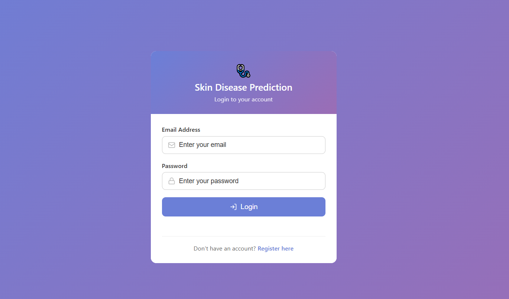
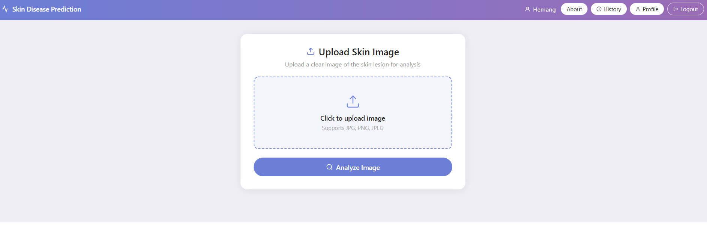
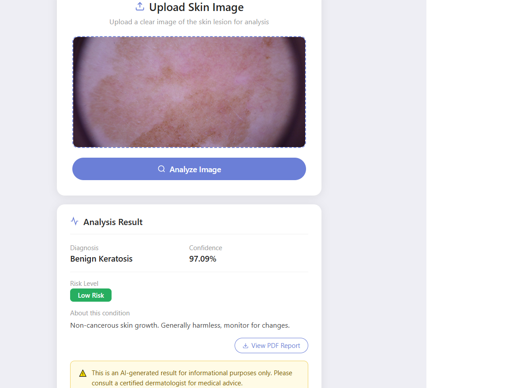
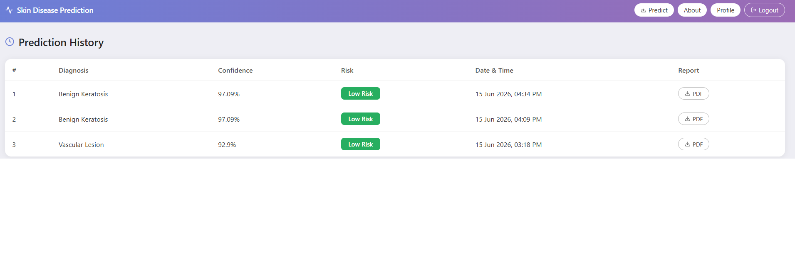
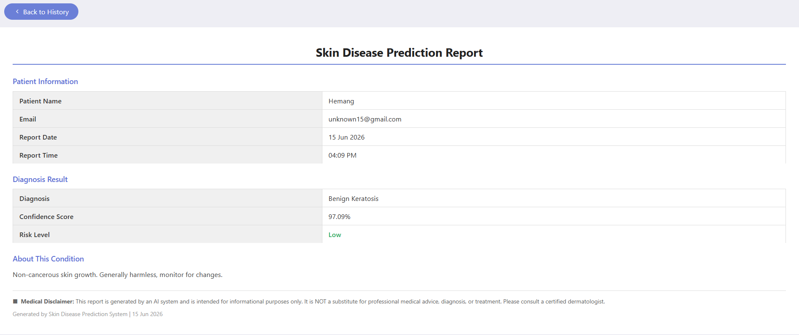
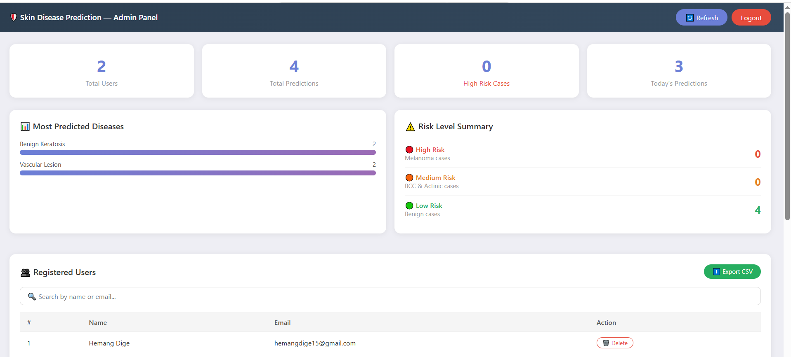

# 🔬 Skin Disease Prediction System

An AI-powered web application that detects and classifies skin diseases from dermoscopic images using a custom-trained Convolutional Neural Network (CNN). Built as a BE Final Year Project.


---

## 📖 Overview

This system allows users to upload an image of a skin lesion and receive an AI-generated prediction of the disease type, along with confidence score, risk level, and a detailed description. The app includes user authentication, prediction history, downloadable PDF reports, and an admin dashboard for monitoring usage.

> ⚠️ **Medical Disclaimer:** This system is developed for educational purposes only. It is NOT a substitute for professional medical advice. Always consult a certified dermatologist for proper diagnosis and treatment.

---

## ✨ Features

- 🔐 **User Authentication** — Register, login, and session management
- 🖼️ **Image Upload & Analysis** — Upload skin lesion images for instant AI prediction
- 🧠 **CNN-based Classification** — Classifies into 7 skin disease categories
- 📊 **Confidence & Risk Level** — Shows prediction confidence and risk severity (Low/Medium/High)
- 📜 **Prediction History** — View all past predictions, stored permanently in SQLite
- 📄 **PDF Report Generation** — Download a professional diagnosis report
- 👤 **Profile Management** — Edit user name
- 🛡️ **Admin Dashboard** — View all users, predictions, statistics, and export data as CSV
- 📱 **Responsive UI** — Built with pure HTML, CSS, and JavaScript (no frameworks)

---

## 🛠️ Tech Stack

| Category | Technologies |
|---|---|
| **Machine Learning** | TensorFlow / Keras (CNN), Scikit-learn (SVM, Random Forest), OpenCV, NumPy, Pandas |
| **Backend** | Python, Flask |
| **Frontend** | HTML, CSS, JavaScript (Vanilla, no frameworks) |
| **Database** | SQLite |
| **Development** | Jupyter Notebook (model training), VS Code |

---

## 📊 Dataset

- **Name:** HAM10000 (Human Against Machine with 10000 training images)
- **Size:** 10,015 dermoscopic images
- **Classes:** 7 skin disease categories
- **Source:** Kaggle / ISIC Archive

### Disease Classes & Risk Levels

| Disease | Risk Level |
|---|---|
| Melanoma | High |
| Basal Cell Carcinoma | Medium |
| Actinic Keratoses | Medium |
| Benign Keratosis | Low |
| Melanocytic Nevus | Low |
| Dermatofibroma | Low |
| Vascular Lesion | Low |

---

## 🧠 Model Performance

A custom CNN was trained from scratch and compared against SVM and Random Forest (using CNN-extracted features).

| Model | Accuracy | Used in App |
|---|---|---|
| **CNN (Custom)** | **73.42%** | ✅ Yes |
| Random Forest | 73.14% | ❌ No |
| SVM | 66.99% | ❌ No |

**Model Architecture:**
- Input: 224x224x3 RGB images
- 3 Convolutional blocks (32 → 64 → 128 filters) with MaxPooling
- Flatten → Dense(256, ReLU) → Dropout(0.5) → Dense(7, Softmax)
- Trained with `ModelCheckpoint` (saves best validation accuracy) and `EarlyStopping`

---

## ⚙️ How It Works

```
User uploads skin lesion image
        ↓
Flask receives image via /predict route
        ↓
OpenCV preprocesses image (resize to 224x224, normalize)
        ↓
CNN model predicts probability for each of 7 classes
        ↓
Highest probability class = Diagnosis
        ↓
Risk level & description attached
        ↓
Result + history saved to SQLite database
        ↓
Result displayed to user with option to download PDF report
```

---

## 📁 Project Structure

```
skin/
├── app.py                          # Flask backend application
├── database.db                     # SQLite database (users + predictions)
├── requirements.txt                # Python dependencies
├── models/
│   ├── model.h5                    # Trained CNN model
│   ├── rf_best.pkl                 # Random Forest model
│   └── svm_best.pkl                # SVM model
├── static/
│   ├── skin_disease_login_signup_v3.html   # Login & Registration page
│   ├── skin_disease_full_app.html          # Main dashboard, history, profile, PDF
│   └── admin.html                          # Admin panel
└── Skin_Disease_Prediction.ipynb   # Model training notebook
```

---

## 🚀 Installation & Setup

### Prerequisites
- Python 3.10+
- pip

### Steps

1. **Clone the repository**
```bash
git clone https://github.com/HemangDige/skin-disease-prediction.git
cd skin-disease-prediction
```

2. **Create a virtual environment**
```bash
python -m venv skin_env
skin_env\Scripts\activate      # Windows
source skin_env/bin/activate   # macOS/Linux
```

3. **Install dependencies**
```bash
pip install -r requirements.txt
```

4. **Add the trained model**

   Place `model.h5` inside the `models/` folder (model file is excluded from repo due to size — train using the provided notebook or request the file).

5. **Run the application**
```bash
python app.py
```

6. **Open in browser**
```
http://127.0.0.1:5000
```

---

## 🛡️ Admin Panel

Access the admin dashboard at:
```
http://127.0.0.1:5000/admin
```

| Field | Default |
|---|---|
| Username | `admin` |
| Password | `admin123` |

**Admin features:**
- Total users & predictions overview
- Risk level distribution (High/Medium/Low)
- Most predicted diseases (bar chart)
- Search/filter users and predictions
- Export users & predictions as CSV

---

## 🗄️ Database Schema

**`users` table**

| Column | Type | Description |
|---|---|---|
| id | INTEGER | Primary key |
| name | TEXT | User full name |
| email | TEXT | Unique email (login ID) |
| password | TEXT | User password |
| created | TEXT | Registration date |

**`predictions` table**

| Column | Type | Description |
|---|---|---|
| id | INTEGER | Primary key |
| email | TEXT | Linked user email |
| diagnosis | TEXT | Predicted disease |
| confidence | TEXT | Model confidence % |
| risk | TEXT | High / Medium / Low |
| description | TEXT | Disease description |
| date | TEXT | Prediction date |
| time | TEXT | Prediction time |

---

## 📸 Screenshots

> Add screenshots in a `screenshots/` folder and reference them below.

| Login | Dashboard | Result |
|---|---|---|
|  |  |  |

| History | PDF Report | Admin Panel |
|---|---|---|
|  |  |  |

---

## 🔮 Future Improvements

- [ ] Add data augmentation to improve CNN accuracy
- [ ] Hash passwords (currently stored as plain text — for educational demo only)
- [ ] Deploy to cloud (Render / Heroku / AWS)
- [ ] Add email-based password reset
- [ ] Improve UI with mobile-first design
- [ ] Add multi-language support

---

## 👨‍💻 Author

**Hemang Dige**
BE Final Year Project — Computer Engineering

---

## 📄 License

This project is developed for **educational purposes only** as part of a BE Final Year Project.